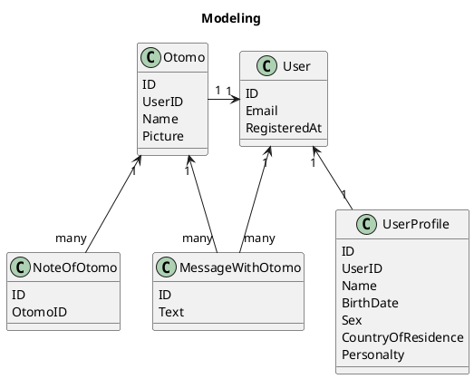

# Modeling

```plantuml
@startuml
title Modeling


class User {
    ID
    Email
    RegisteredAt
}

class UserProfile {
    ID
    UserID
    Name
    BirthDate
    Sex
    CountryOfResidence
    Personalty
}

class Otomo {
    ID
    UserID
    Name
    Picture
}

class NoteOfOtomo {
    ID
    OtomoID
}

class MessageWithOtomo {
    ID
    Text
}

User "1"<--"1" UserProfile
Otomo "1"->"1" User
User "1"<-"many" MessageWithOtomo
Otomo "1"<--"many" MessageWithOtomo
Otomo "1"<--"many" NoteOfOtomo


@enduml
```
